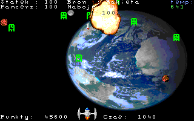

# Kosmici Atakują

`Kosmici` is a simple shoot 'em up DOS game that I wrote in high school.



[DOS binary download](https://github.com/mlesniew/kosmici/releases/download/1.0/kosmita.tgz) 


## Running

The game can be run on modern systems only with [DOSBox](https://www.dosbox.com/).

To run on Linux with DOSBox installed use:
```
mkdir kosmita
cd kosmita
curl -L https://github.com/mlesniew/kosmici/releases/download/1.0/kosmita.tgz | zcat | tar -x
dosbox kosmita.exe
```


## Running with js-dos in the browser

The game can also be run with [js-dos](https://js-dos.com/) in the browser.  The required server setup can be easily
done with Docker:
```
git clone git@github.com:mlesniew/kosmici.git
cd kosmici
docker build -t kosmita .
docker run --rm -p8000:8000 kosmita
```

The game will be available at [http://localhost:8000](http://localhost:8000).  Unfortunately, the game can be very
slow when it's run this way.


## How to play

* Use the mouse to move your space ship
* Use the left mouse button to fire
* Use the right mouse button to toggle between weapons
* Shoot down rocks and aliens before they hit you
* Firing increases ship temperature
* When ship temperature gets too high, the ship looses energy/HP
* When ship temperature drops enough, the ship repairs itself
